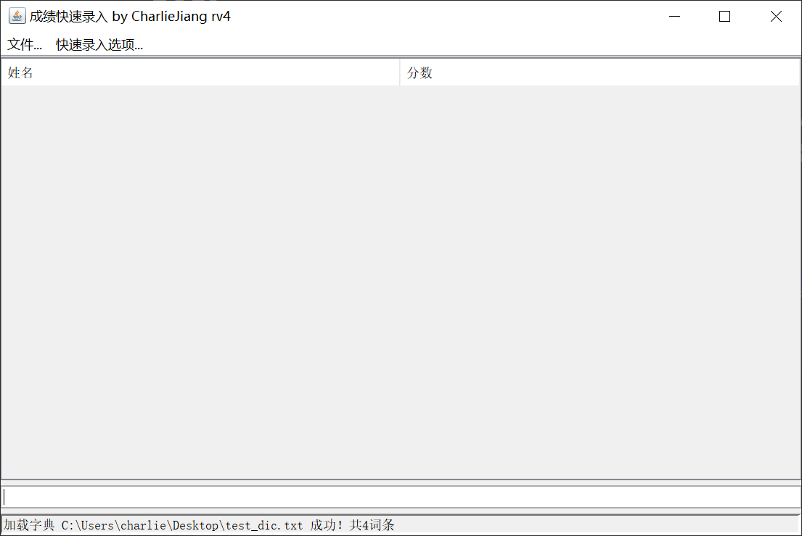
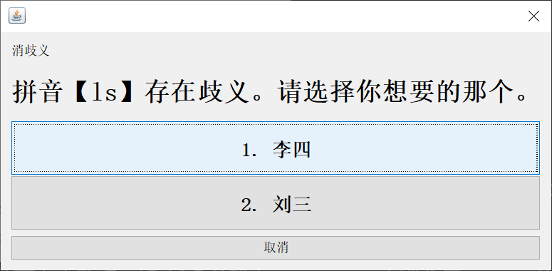
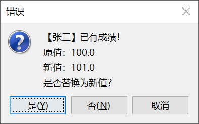
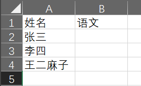
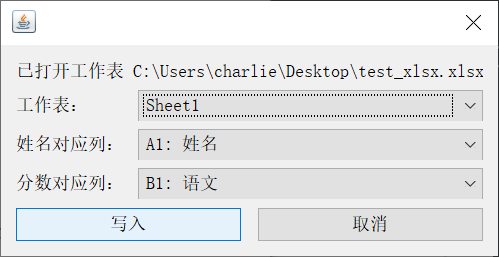
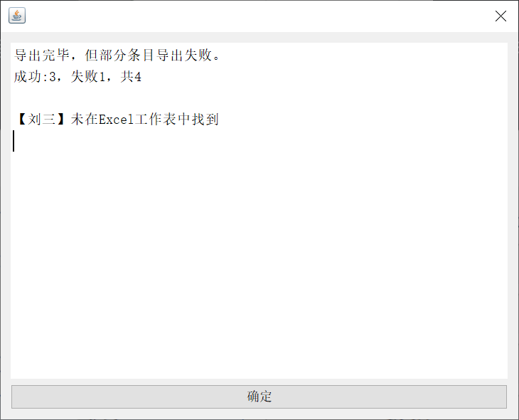
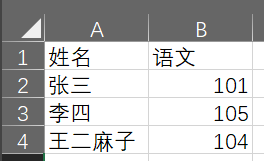

# 成绩快速录入工具

## 动机

该程序是几年前老师经常搞小测要统计成绩，而我为了减少科代表的工作量搞出来的玩意。

## 特性

- 自定义词典（推荐拼音首字母）录入，只需 `zs 90[回车]ls 99[回车]` 即可高速录入
- 免空格录入（要求词典里的短名仅含英文字母）
- 免小数点录入（具体见下）
- 导出 csv 或 Excel 文档

## 安装

你的系统需要预先安装 Java 8 或以上版本。

对于终端用户，可以从 GitHub Release 直接下载已经打包好的文件。 Windows 用户可以下载 exe（jar 亦可，如果你的文件关联正确配置），Linux 或 macOS 用户应当下载 jar 文件。装好后应该可以双击启动。

## 编译与开发

你需要 Gradle 来编译本项目，推荐使用 Gradle 7 以上版本。直接执行 `gradle fatJar` 即可得到包含所有依赖的 jar （以 `-all` 结尾）文件。

如果要在 IDE 中开发，你需要安装有 Kotlin 插件的 IntelliJ IDEA。在其中打开项目并同步，即可进行开发。

## 词典准备

为了实现录入，需要先准备一个词典文件。实际上就是一个文本文件，里面每一行的格式为：`姓名 短名（如拼音首字母）`。下面是一个例子：

```
张三 zs
李四 ls
王二麻子 wemz
刘三 ls
```

注意姓名不可重复（确有重名需要用“（小）”等后缀等区分），但拼音首字母可重复。

将文件保存为 **UTF-8** 编码的 txt 文件备用。

## 录入

打开程序后，需要先选择 文件-打开字典，载入上述词典文件，如图。在后续的运行中，程序会尝试加载上次加载的词典。



而后选择下方的文本框，开始录入。同时可以在快速录入选项中开关一些模式。注意如果分数不是 100 或 150 分制，免小数点录入不可用。

- 正常的录入模式：输入 `短名 分数（仅支持数字）`，如 `zs 99`。
- 免空格录入：输入 `短名分数`，如 `zs99`。
- 免小数点录入：仅用于 100 或 150 分制：
  - 对于百分以上的分，直接录入去掉小数点的值，如 150 分输入 `zs 150`，133.5 分输入 `zs 1335`
  - 对于 0~100 分中的整数分，直接录入，如 15 分输入 `zs 15`
  - 对于 0~19 分中的小数分，必须带上小数点，如 14.5 分输入 `zs 14.5`，否则会与 `145.0` 分混淆。
  - 对于 20~99 分中的小数分，可省略不带小数点，如 59.5 分输入 `zs 595`。
- 同时打开两者：就可以输入 `zs595` 等于给张三录入 `59.5` 分的操作。

如果出现两个人有相同的拼音时，会提示消歧义，选择正确的那个即可，同时在这个消歧义界面不用用鼠标点选，可直接按对应项前的数字。



如果想修改一个人的成绩，直接再次录入即可覆盖。



如果想删除已经录入的条目，可以直接在表格中选中，右键删除。

## 数据导出

录入完成或想保存进度时，选择文件-保存或按 Ctrl+S 即可将文件保存为 CSV 格式。同时程序也能打开 CSV 格式的文件，选择文件-打开或按 Ctrl+O 即可。保存出来的文件形如：

```
张三 101.0
李四 105.0
刘三 103.0
王二麻子 104.0
```

可以用任意可处理这样格式的程序导入该文件。

同时，程序支持写入 xlsx 文件。为此你需要先准备一个包含表头和姓名列的模板表格，如下：



保存后关闭 Excel，在程序中选择文件-写入Excel文件，打开想写入的xlsx，并像下图那样选好工作表、姓名和分数的列（注意不要选错误覆盖了）：



点写入即可，同时如果有条目写入失败，会弹出提示。



打开 xlsx 文件，可以发现导出已经完成了。



这样就完成了数据的导出。

